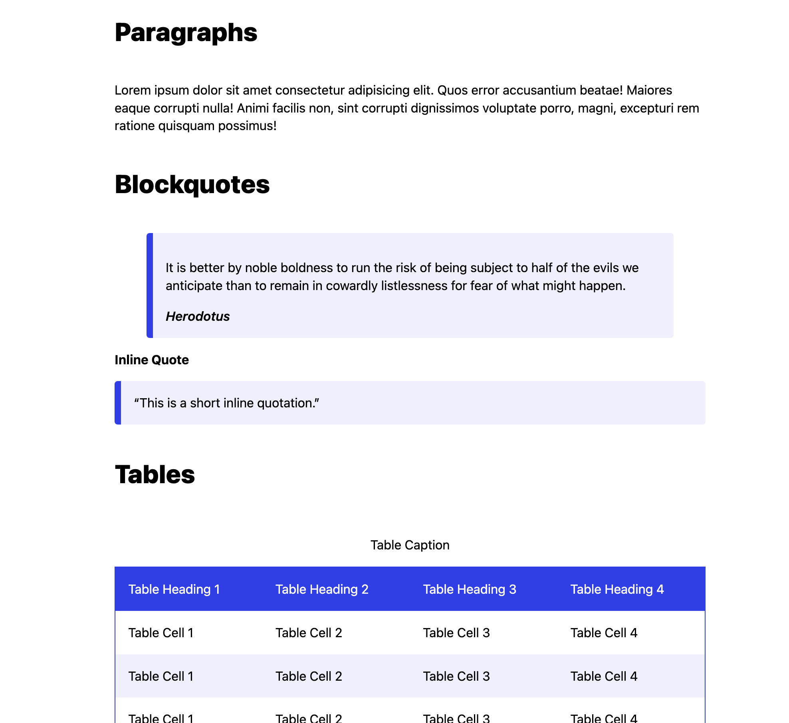

# Slightly Better CSS

A webpage without any CSS is slightly too ugly, libraries like Bootstrap are way too heavy, and you have too much taste to use the other CSS libraries out there. Slightly Better CSS is a small, simple stylesheet for any project that needs to look just a little bit better.

We don't believe in classes or ID's, all our styling is around built-in variables, so you can write simple HTML. At only 2KB, Slightly Better CSS won't weight down your application, and is easily extendable.


## Usage

If you want to use this CSS directly in your project, include the following:

```
<link rel="stylesheet" href="https://abbeyyacoe.github.io/slightly-better.css">
```
## Preview

